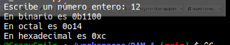

# Practica 1.1

## Sistema de codificacion y aritmetica binaria

### 1. Crea un fichero llamado “codifica_decimal.py” con el siguiente contenido. Una vez guardado pon permisos de ejecución con “chmod +x codifica_dacimal.py” y obtén una captura del resultado tras ejecutar “./codifica_decimal.py”. ¿Con qué prefijo indica python que está mostrando un número en el sistema de codificación binario, octal y hexadecimal?

```sh 
    #!/usr/bin/env python3
    # Obtiene una cadena de caracteres escrita por teclado
    numero_cadena = input("Escribe un número entero: ")
    # Transforma la cadena en un número entero
    numero_decimal = int(numero_cadena)
    # Muestra la codificación binaria, octal y hexadecimal
    print("En binario es", bin(numero_decimal))
    print("En octal es", oct(numero_decimal))
    print("En hexadecimal es", hex(numero_decimal))
```


El prefijo que indica que esta mostrando:
- **Binario**: El prefijo es el **0b**, que la **b** significa binario. 
- **Octal**: El prefijo es el **0o**, donde la **o** es octal.
- **Hexadecimal**: El prefijo es **0x**, que **x** significa hexadecimal.

