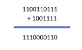
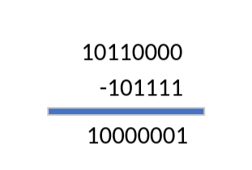

# Practica 1.1

## Sistema de codificacion y aritmetica binaria

### 1. Crea un fichero llamado “codifica_decimal.py” con el siguiente contenido. Una vez guardado pon permisos de ejecución con “chmod +x codifica_dacimal.py” y obtén una captura del resultado tras ejecutar “./codifica_decimal.py”. ¿Con qué prefijo indica python que está mostrando un número en el sistema de codificación binario, octal y hexadecimal?

```sh 
    #!/usr/bin/env python3
    # Obtiene una cadena de caracteres escrita por teclado
    numero_cadena = input("Escribe un número entero: ")
    # Transforma la cadena en un número entero
    numero_decimal = int(numero_cadena)
    # Muestra la codificación binaria, octal y hexadecimal
    print("En binario es", bin(numero_decimal))
    print("En octal es", oct(numero_decimal))
    print("En hexadecimal es", hex(numero_decimal))
```


El prefijo que indica que esta mostrando:
- **Binario**: El prefijo es el **0b**, que la **b** significa binario. 
- **Octal**: El prefijo es el **0o**, donde la **o** es octal.
- **Hexadecimal**: El prefijo es **0x**, que **x** significa hexadecimal.

### 2. El método “int(string, base)” en python permite convertir una cadena de caracteres (string) a un número entero codificado con la base indicada. Si no se indica la base, por defecto utiliza el sistema decimal (base 10). Crea unprograma en python que solicite un número binario y muestre su codificación en octal, hexadecimal y decimal.

```sh
    #!/usr/bin/env python

    numero_cadena = input("Escribe un numero binario: ")

    numero_binario=int(numero_cadena, 2)
    
    print("Numero Decimal: ", int(numero_binario))

    print("Numero hexadecimal: ", hex(numero_binario))

    print("Numero octal: ", oct(numero_binario))
```

### 3. Crea un programa en python que solicite un número hexadecimal y muestre su codificación en binario, octal y decimal.

```sh
    #!/usr/bin/env python

    numero_cadena = input("Escribe un numero hexadecimal: ")

    numero_hexa=int(numero_cadena, 16)
    
    print("Numero decimal: ", int(numero_hexa))

    print("Numero binario: ", bin(numero_hexa))

    print("Numero octal: ", oct(numero_hexa))
```

### 4. Codifica a mano de binario a decimal los siguientes números, comprueba con las aplicaciones realizadas anteriormente si la solución es correcta:

a. 10111<sub>2</sub> = 1x2^4+1x2^2+1x2^1+1x2^0 = 23

b. 110111<sub>2</sub> = 1x2^5+1x2^4+1x2^2+1x2^1+1x2^0 = 55

### 5. Codifica a mano de decimal a binario los siguientes números, comprueba con las aplicaciones realizadas anteriormente si la solución es correcta.

a. 101<sub>10</sub> => 1100101

|128|64|32|16|8|4|2|1|
|---|--|--|--|-|-|-|-|
| 0 | 1| 1| 0|0|1|0|1|

b. 26<sub>10</sub> => 11010

|128|64|32|16|8|4|2|1|
|---|--|--|--|-|-|-|-|
| 0 | 0| 0| 1|1|0|1|0|

### 6. Codifica a mano de binario a octal y a hexadecimal los siguientes números, comprueba con las aplicaciones realizadas anteriormente si la solución es correcta.

a. 111101110<sub>2</sub> = 1DD<sub>16</sub> = 756<sub>8</sub>
|0001|1110|1110|  
|----|----|----|
| 1  |  D | D  |

|111|101|110|
|---|---|---|
| 7 | 5 | 6 |

b. 1010111<sub>2</sub> = 57<sub>16</sub> = 127<sub>8</sub>
|0101|0111|
|----|----|
|  5 |  7 |

|001|010|111|
|---|---|---|
| 1 | 2 | 7 |

### 7. Codifica a mano de hexademimal a binario los siguientes números, comprueba con las aplicaciones realizadas anteriormente si la solución es correcta.

a. 1F1<sub>16</sub> = 111110001<sub>2</sub>
| 1  | F  |  1 |
|----|----|----|
|0001|1111|0001|

b. A2<sub>16</sub> = 10100010<sub>2</sub>
| A  | 2  |
|----|----|
|1010|0010| 

### 8. Realiza a mano las siguientes operaciones en binario:

a. 100110111 + 1001111 = 1110000110



b. 10110000 – 101111 = 10000001



c. 11101110 x 1010 = 
| | | | |0|0|0|0|0|0|0|0|
|-|-|-|-|-|-|-|-|-|-|-|-| 
| | | |1|1|1|0|1|1|1|0| |
|-|-|-|-|-|-|-|-|-|-|-|-|
| | |0|0|0|0|0|0|0|0| | |
|-|-|-|-|-|-|-|-|-|-|-|-|
| |1|1|1|0|1|1|1|0| | | |
|-|-|-|-|-|-|-|-|-|-|-|-|  
|-|-|-|-|-|-|-|-|-|-|-|-|
|1|0|0|1|0|1|0|0|1|1|0|0|
                            