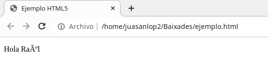

# Practica 1.2

## Sistemas de representación numéricos y alfanuméricos

### 1. Crea un fichero llamado ejemplo.py que tenga el siguiente contenido:
```sh
    print (“Hola”)
```

#### a. Guarda el fichero, abre el terminal (Ctrl+Alt+T), accede al directorio donde hayas guardado el fichero y ejecuta “python2 ejemplo.py”. Obtén una captura del resultado obtenido.


#### b. Modifica el print del fichero anterior para que aparezca por pantalla “Hola Raúl”. Vuelve a ejecutar “python2 ejemplo.py”. ¿Qué significa el error que aparece por pantalla? Busca como solucionar el problema para que python2 acepte caracteres en UTF-8.


Significa que la tilde en el Raúl no esta en la codificación que la que python esta trabajando, para solucionarlo se puede poner el codigo del ú, o cambiando la codificación con el que trabaja python. 


#### c. Crea un fichero ejemplo2.py con el siguiente contenido y obtén una captura del resultado tras ejecutar “python2 ejemplo2.py” ¿Qué está haciendo el programa?:

```sh
    cadena = u'\u00A9\u0052\u0061\u00FA\u006C \u263A'
    print (cadena)
```

Muestra por pantalla lo que esta en codificado en la variable cadena:


#### d. Crea ahora un fichero llamado ejemplo3.py con el siguiente contenido y obtén una captura del resultado tras ejecutar “python2 ejemplo3.py” ¿Qué está haciendo el programa?:

```sh
    #-*- coding:utf-8 *-*
    letra = 'Ñ'
    print (hex(ord(letra.decode("utf-8"))))
```

Muestra por pantalla el codigo utf-8 que seria la letra Ñ en hexadecimal, que es el 0xd1


#### e. Crea ahora un fichero llamado ejemplo4.py con el siguiente contenido, pon permiso de ejecución con “chmod +x ejemplo4.py” y obtén una captura del resultado tras ejecutar “./ejemplo4.py”. ¿Por qué ahora he podido usar caracteres no ASCII en el código y no he obtenido mensajes de error?

```sh
    #!/usr/bin/env python3
    nombre = input ("¿Cómo te llamas? ")
    print("Hola ",nombre)
```


Python 3 autodetecta la codificaion que se esta usando, por lo tanto es capaz a de mostrar caracteres que no son ASCII.

### 2. Crea un fichero llamado ejemplo.html con el siguiente contenido:

```sh
    <!doctype html>
    <html lang="es">
        <head>
            <meta charset="us-ascii">
            <title>Ejemplo HTML5</title>
        </head>
        <body>
            <p>Hola Raúl</p>
        </body>
    </html>
```

#### a. Abre el fichero ejemplo.html con un navegador web y obtén una captura de pantalla del resultado. ¿Por qué no se muestra correctamente la página?



No se muestra correctamente porque los caracteres estan en foramto ASII de Estados Unidos.

#### b. Modifica el ejemplo.html para solucionar el problema.

```sh
    <!doctype html>
    <html lang="es">
        <head>
            <meta charset="utf-8">
            <title>Ejemplo HTML5</title>
        </head>
        <body>
            <p>Hola Raúl</p>
        </body>
    </html>
```

#### c. Lee la página https://www.w3schools.com/charsets/ y contesta a la siguiente pregunta: ¿Cuales han sido los estándares de codificación por defecto para las páginas html desde su origen hasta hoy?

Desde HTML 2.0 a HTML 4.01 el estandar de codificacion por defecto era el ISO-8859-1, que es una extension del ASCII. A partir del HTML 4.01 se permite utlizar el UTF-8 y en el HTML 5.0 la codificaion estandar es el UTF-8.

### 3. En GNU/Linux al usar “Shift+Ctrl+U” podemos escribir el código en hexadecimal UNICODE de cualquier carácter aunque no esté en el teclado. Intenta escribir en LibreOffice Writer los siguientes emoticonos indicando la codificación hexadecimal utilizada. Podemos buscar el carácter en http://www.unicode.org/charts/#symbols


### 4. Imagina que tienes que inventar un código que haga corresponder cada carácter a un número binario. Para nuestro sistema informático únicamente necesitamos usar los números 0, 1, 2 y 3, las vocales en minúsculas y mayúsculas y las consonantes “S”, “R” y “P”. ¿De cuantos bits será el código que necesitamos?. Diseñarlo y escribir en tu código la palabra “SERPIS”.

Para poder colocar 17 carcateres, necesito 5 bits, que son 32 combinaciones posibles, SERPIS es igual a: 01110 01010 01111 10000 01011 01110

|Codigo|Caracter|
|------|--------|
|00000|0|
|00001|1|
|00010|2|
|00011|3|
|00100|a|
|00101|e|
|00110|i|
|00111|o|
|01000|u|
|01001|A|
|01010|E|
|01011|I|
|01100|O|
|01101|U|
|01110|S|
|01111|R|
|10000|P|


### 5. Realiza en una tabla todas las combinaciones con 4 bits e indica que valor representa si estuviera codificado en los formatos signo-magnitud o en coma fija.

|Combinaciones con 4 bits|Valor signo-magnitud|Valor en coma fija|
|------------------------|--------------------|------------------|
|0000|0|0|
|0001|1|1|
|0010|2|2|
|0011|3|3|
|0100|4|4|
|0101|5|5|
|0110|6|6|
|0111|7|7|
|1000|0|8|
|1001|-1|9|
|1010|-2|10|
|1011|-3|11|
|1100|-4|12|
|1101|-5|13|
|1110|-9|14|
|1111|-7|15|

### 6. Haz la representación en exceso 128 con 8 bits de los números siguientes:

a. 6 = 128 + 6 = 134 = 10000110

|128|64|32|16|8|4|2|1|
|---|--|--|--|-|-|-|-|
|1  |0 |0 |0 |0|1|1|0|

b. -11 = 128 + (-11) = 117 = 01110101

|128|64|32|16|8|4|2|1|
|---|--|--|--|-|-|-|-|
|  0| 1| 1| 1|0|1|0|1|

c. 0 = 128 + 0 = 128 = 10000000

d. 156 = 128 + 156 = 284, excede los bits que se pueden representar con exceso 128 con 8 bits, solo alcanza hasta al 255

### 7. Representa en complemento a 2 los siguientes números en binario:

a. 101001110 = 010110010

Ca1: 101001110 = 010110001 -> Ca2: 010110001 + 1 = 010110010  

b. 101101110 = 010010010

Ca1: 101101110 = 010010001 -> Ca2: 010010001 + 1 = 010010010

c. 101011111000 = 010100001000

Ca1: 101011111000 = 010100000111 -> Ca2: 010100000111 + 1 = 010100001000

d. 11000110001011 = 00111001110101

Ca1: 11000110001011 = 00111001110100 -> Ca2: 00111001110100 + 1 = 00111001110101 

### 8. Representa en BCD los siguientes números decimales:

a. 34 = 0011 0100
b. 217 = 0010 0001 0111
c. 2523 = 0010 0101 0010 0011
d. 77900 = 0111 0111 1111 0000 0000

### 9. Normaliza en IEEE 754 de simple precisión, o coma flotante, los números reales: