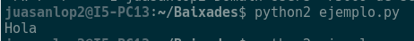
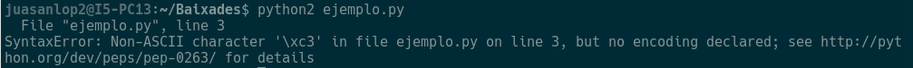
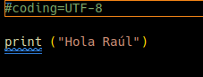
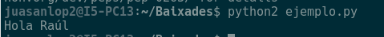
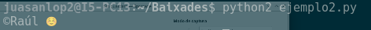
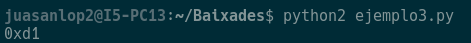
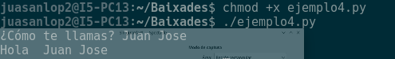

# Practica 1.2

## Sistemas de representación numéricos y alfanuméricos

### 1. Crea un fichero llamado ejemplo.py que tenga el siguiente contenido:
```sh
    print (“Hola”)
```

#### a. Guarda el fichero, abre el terminal (Ctrl+Alt+T), accede al directorio donde hayas guardado el fichero y ejecuta “python2 ejemplo.py”. Obtén una captura del resultado obtenido.



#### b. Modifica el print del fichero anterior para que aparezca por pantalla “Hola Raúl”. Vuelve a ejecutar “python2 ejemplo.py”. ¿Qué significa el error que aparece por pantalla? Busca como solucionar el problema para que python2 acepte caracteres en UTF-8.



Significa que la tilde en el Raúl no esta en la codificación que la que python esta trabajando, para solucionarlo se puede poner el codigo del ú, o cambiando la codificación con el que trabaja python. 




#### c. Crea un fichero ejemplo2.py con el siguiente contenido y obtén una captura del resultado tras ejecutar “python2 ejemplo2.py” ¿Qué está haciendo el programa?:

```sh
    cadena = u'\u00A9\u0052\u0061\u00FA\u006C \u263A'
    print (cadena)
```

Muestra por pantalla lo que esta en codificado en la variable cadena:



#### d. Crea ahora un fichero llamado ejemplo3.py con el siguiente contenido y obtén una captura del resultado tras ejecutar “python2 ejemplo3.py” ¿Qué está haciendo el programa?:

```sh
    #-*- coding:utf-8 *-*
    letra = 'Ñ'
    print (hex(ord(letra.decode("utf-8"))))
```

Muestra por pantalla el codigo utf-8 que seria la letra Ñ en hexadecimal, que es el 0xd1



#### e. Crea ahora un fichero llamado ejemplo4.py con el siguiente contenido, pon permiso de ejecución con “chmod +x ejemplo4.py” y obtén una captura del resultado tras ejecutar “./ejemplo4.py”. ¿Por qué ahora he podido usar caracteres no ASCII en el código y no he obtenido mensajes de error?

```sh
    #!/usr/bin/env python3
    nombre = input ("¿Cómo te llamas? ")
    print("Hola ",nombre)
```

