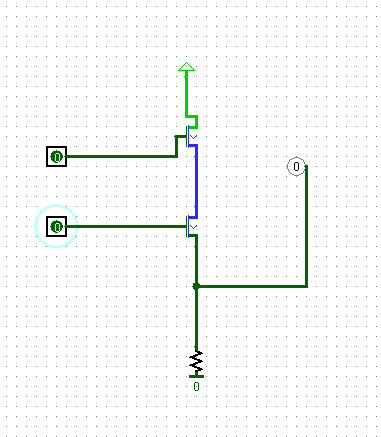
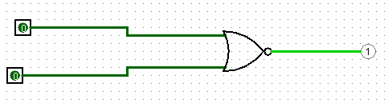

# Practica 1 3

## Álgebra de Boole, transistores y puertas lógicas

### 1. Realiza con el simulador logisim los siguientes cirtcuitos usando transistores bipolares tipo N, prueba su funcionamiento e indica en cada caso a que puerta lógica se corresponde. Conecta la puerta lógica correspondiente a las entradas de cada circuito para comprobar tu respuesta.

a. 

Actuan como puerta NOR, ya que cuando son 0 el resultado es 1 y cuando cualquiera de los 2 o los 2 a la vez, el resultado es 0.

b. 