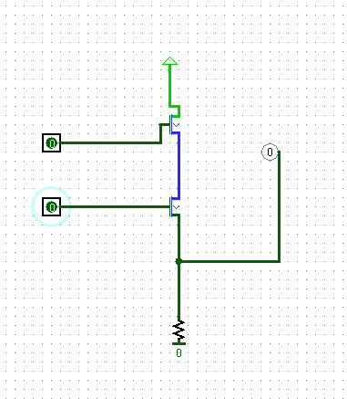
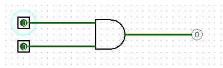
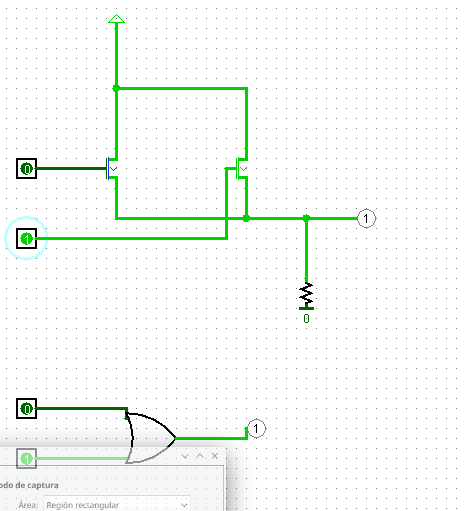
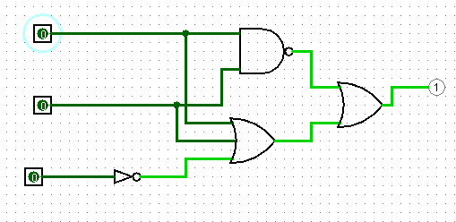
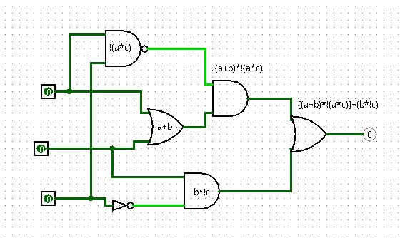
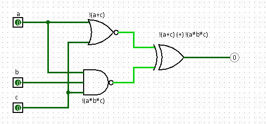

# Practica 1 3

## Álgebra de Boole, transistores y puertas lógicas

### 1. Realiza con el simulador logisim los siguientes cirtcuitos usando transistores bipolares tipo N, prueba su funcionamiento e indica en cada caso a que puerta lógica se corresponde. Conecta la puerta lógica correspondiente a las entradas de cada circuito para comprobar tu respuesta.

a. 

Actuan como puerta AND, ya que solo se activa cuando ambos pin son 1.

b. 

Los transistores actuan como una puerta OR, porque cuando uno de los pines es 1, el resultado ya es 1.

### 2 Implementa con puertas lógicas las funciones siguientes, escribe sus tablas de verdad y comprueba si los resultados son correctos con el simulador, captura una imagen de cada circuito en funcionamiento.

a. F = (a + b + !c ) + !(a * b)

|a|b|c|F|
|-|-|-|-|
|0|0|0|1|
|1|0|0|1|
|0|1|0|1|
|0|0|1|1|
|0|1|1|1|
|1|1|0|1|
|1|0|1|1|
|1|1|1|1|

b. F = [(a + b) * !(a * c)] + (b * !c)

|a|b|c|F|
|-|-|-|-|
|0|0|0|0|
|1|0|0|1|
|0|1|0|1|
|0|0|1|0|
|0|1|1|1|
|1|1|0|1|
|1|0|1|0|
|1|1|1|0|

c. F = !(a + c) (+) !(a * b * c)

|a|b|c|F|
|-|-|-|-|
|0|0|0|0|
|1|0|0|1|
|0|1|0|0|
|0|0|1|1|
|0|1|1|1|
|1|1|0|1|
|1|0|1|1|
|1|1|1|0|

### 4 Escribe la ecuación y la tabla de verdad de los siguientes circuitos:

a. F = (A * !B) + (!A * B)

|A|B|F|
|-|-|-|
|0|0|0|
|1|0|1|
|0|1|1|
|1|1|0|

b. F = ![!A + (!A * !B) + !(A * B)] + B 

|A|B|F|
|-|-|-|

c. F = ![((!A * B) (+) !(B + C)) * (!(C + B) + C + !C)]