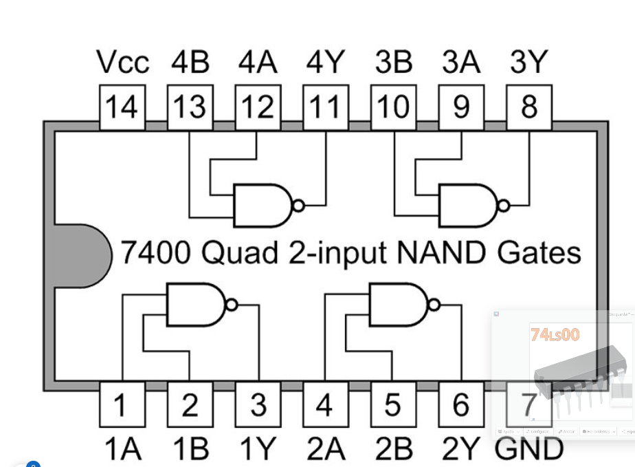

# Practica 1 3

## Álgebra de Boole, transistores y puertas lógicas

### 1. Realiza con el simulador logisim los siguientes cirtcuitos usando transistores bipolares tipo N, prueba su funcionamiento e indica en cada caso a que puerta lógica se corresponde. Conecta la puerta lógica correspondiente a las entradas de cada circuito para comprobar tu respuesta.

a. 

Actuan como puerta AND, ya que solo se activa cuando ambos pin son 1.

b. 

Los transistores actuan como una puerta OR, porque cuando uno de los pines es 1, el resultado ya es 1.

### 2 Implementa con puertas lógicas las funciones siguientes, escribe sus tablas de verdad y comprueba si los resultados son correctos con el simulador, captura una imagen de cada circuito en funcionamiento.

a. F = (a + b + !c ) + !(a * b)

|a|b|c|F|
|-|-|-|-|
|0|0|0|1|
|1|0|0|1|
|0|1|0|1|
|0|0|1|1|
|0|1|1|1|
|1|1|0|1|
|1|0|1|1|
|1|1|1|1|

b. F = [(a + b) * !(a * c)] + (b * !c)

|a|b|c|F|
|-|-|-|-|
|0|0|0|0|
|1|0|0|1|
|0|1|0|1|
|0|0|1|0|
|0|1|1|1|
|1|1|0|1|
|1|0|1|0|
|1|1|1|0|

c. F = !(a + c) (+) !(a * b * c)

|a|b|c|F|
|-|-|-|-|
|0|0|0|0|
|1|0|0|1|
|0|1|0|0|
|0|0|1|1|
|0|1|1|1|
|1|1|0|1|
|1|0|1|1|
|1|1|1|0|

### 3 Con Pycharm escribe un programa en python que sirva para comprobar si los circuitos del ejercicio anterior son correctos. El tipo booleano en python “bool” puede tomar los valores “True” o “False”, si pasamos un tipo entero “int” a booleano el “True” lo convierte en 1 y el “False” en 0, y a la inversa. Los comparadores booleanos disponibles en python son: and, or, not y ^(para XOR).

### 4 Escribe la ecuación y la tabla de verdad de los siguientes circuitos:

a. F = (A * !B) + (!A * B)

|A|B|F|
|-|-|-|
|0|0|0|
|1|0|1|
|0|1|1|
|1|1|0|

b. F = ![!A + (!A * !B) + !(A * B)] + B 

|A|B|F|
|-|-|-|
|0|0|0|
|1|0|0|
|0|1|1|
|1|1|1|

c. F = ![((!A * B) (+) !(B + C)) * (!(C + B) + C + !C)]

|A|B|C|F|
|-|-|-|-|
|0|0|0|0|
|1|0|0|0|
|0|1|0|0|
|0|0|1|1|
|1|1|0|1|
|0|1|1|0|
|1|0|1|1|
|1|1|1|1|

### 5 Comprueba los teoremas de la absorción y Leyes de Morgan con puertas lógicas usando el simulador.

### 6 Escribir la expresión booleana, símbolo y tabla de verdad para una puerta NAND y NOR de cuatro entradas.

F= !(A * B * C * D)

|A|B|C|D|F|
|-|-|-|-|-|
|0|0|0|0|1|
|1|0|0|0|1|
|0|1|0|0|1|
|0|0|1|0|1|
|0|0|0|1|1|
|1|1|0|0|1|
|0|1|1|0|1|
|0|0|1|1|1|
|1|0|1|0|1|
|1|0|0|1|1|
|1|1|1|0|1|
|1|1|0|1|1|
|0|1|1|1|1|
|0|1|0|1|1|
|1|1|1|1|0|

F= !(A +B + C + D)

|A|B|C|D|F|
|-|-|-|-|-|
|0|0|0|0|1|
|1|0|0|0|0|
|0|1|0|0|0|
|0|0|1|0|0|
|0|0|0|1|0|
|1|1|0|0|0|
|0|1|1|0|0|
|0|0|1|1|0|
|1|0|1|0|0|
|1|0|0|1|0|
|1|1|1|0|0|
|1|1|0|1|0|
|0|1|1|1|0|
|0|1|0|1|0|
|1|1|1|1|0|

### 7 Busca en alguna tienda de electrónica un circuito integrado con puertas NAND. Indica que circuito es, pon una captura del encapsulado del circuito y el diagrama de conexiones de los pines.

https://www.electrocomponentes.es/circuitos-integrados/941-74ls00-4-puertas-nand-dos-entradas-logicas-circuito-integrado-7400-gates.html

### 8 Simplifica las siguientes ecuaciones lógicas aplicando las leyes y teoremas del álgebra de Boole. Indica los pasos realizados para cada simplificación indicando la ley o teorema utilizado y comprueba con el simulador que los 2 circuitos son equivalentes.

a. F = (x + y) * (x + y') ->
    F = x + (y * !y) ->
    F = x 

b. F = (x + y) '* (x' + y')' -> (Morgan)
    F = (!!x * !y) + (!!y * !x) -> (involucion)
    F = (x*!y) + (y*!x) -> (Asociativa)
    F = (x*!x) + (y*!y) -> 
    F = 0

c. F = B * ((D * C') + (D * C)) + (A * B) -> (Distributiva) F = B + (D * D) * (C * !C)  + (A * B) -> (Complementacion) F = B + (A * B) -> (Abosrcion) -> F = B