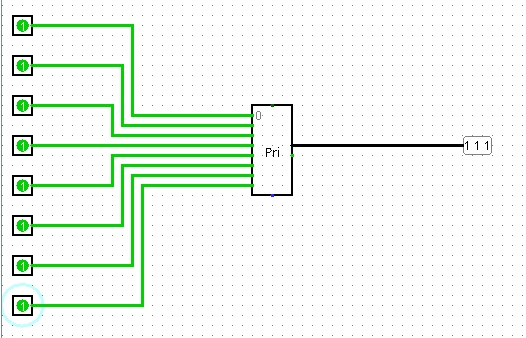
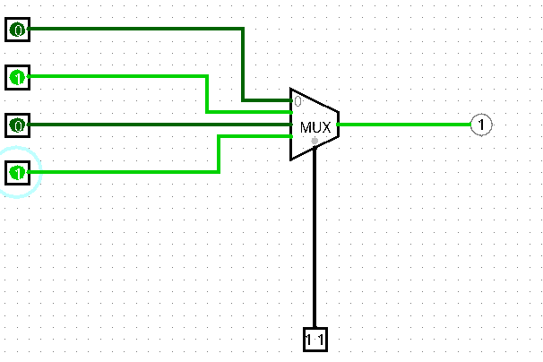

# Practica 1 4

## Circuitos combinacionales y secuenciales

### 1. Crea la tabla de verdad de un codificador de 8 entradas. Prueba con el simulador logisim que la tabla de verdad es correcta. ¿Qué significa que el codificador de logisim tiene prioridad?

|A|B|C|D|E|F|H|G|Resultado|
|-|-|-|-|-|-|-|-|---------|
|1|0|0|0|0|0|0|0|000|
|0|1|0|0|0|0|0|0|001|
|0|0|1|0|0|0|0|0|010|
|0|0|0|1|0|0|0|0|011|
|0|0|0|0|1|0|0|0|100|
|0|0|0|0|0|1|0|0|101|
|0|0|0|0|0|0|1|0|110|
|0|0|0|0|0|0|0|1|111|
|1|1|0|0|0|0|0|0|001|
|1|1|1|0|0|0|0|0|010|
|1|1|1|1|0|0|0|0|011|
|1|1|1|1|1|0|0|0|100|
|1|1|1|1|1|1|0|0|101|
|1|1|1|1|1|1|1|0|110|
|1|1|1|1|1|1|1|1|111|
|0|1|1|0|0|0|0|0|010|
|0|1|1|1|0|0|0|0|011|
|0|1|1|1|1|0|0|0|100|
|0|1|1|1|1|1|0|0|101|
|0|1|1|1|1|1|1|0|110|
|0|1|1|1|1|1|1|1|111|
|0|0|1|1|0|0|0|0|011|
|0|0|1|1|1|0|0|0|100|
|0|0|1|1|1|1|0|0|101|
|0|0|1|1|1|1|1|0|110|
|0|0|1|1|1|1|1|1|111|
|0|0|0|1|1|0|0|0|100|
|0|0|0|1|1|1|0|0|101|
|0|0|0|1|1|1|1|0|110|
|0|0|0|1|1|1|1|1|111|
|0|0|0|0|1|1|0|0|101|
|0|0|0|0|1|1|1|0|110|
|0|0|0|0|1|1|1|1|111|
|0|0|0|0|0|1|1|0|110|
|0|0|0|0|0|1|1|1|111|
|0|0|0|0|0|0|1|1|111|

Un codificador con prioridad significa que si hay varias entradas a la vez, mostrara la entrada de mayor valor.

### 2. ¿Qué salida presentará el siguiente multiplexor si A=0, B=1, C= 0, D=1, S0 = 1 y S1=1?. Justifica tu respuesta y compruebala con el simulador logisim.

El resultado sera el del D=1, porque las entradas de seleccion S0=1 y S1=1, que dan la posicion 3. Son cuatro entradas n-1, por lo tanto escoge la entrada de selccion da 3, que es la entrada 4.

### 3. Prueba en el simulador logisim un demultiplexor de 4 salidas. Crea la tabla de verdad con los resultados obtenidos.

|Entrada|Seleccion|Salida1|Salida2|Salida3|Salida4|
|-------|---------|-------|-------|-------|-------|
|0|00|0|0|0|0|
|0|01|0|0|0|0|
|0|10|0|0|0|0|
|0|11|0|0|0|0|
|1|00|1|0|0|0|
|1|01|0|1|0|0|
|1|10|0|0|1|0|
|1|11|0|0|0|1|

