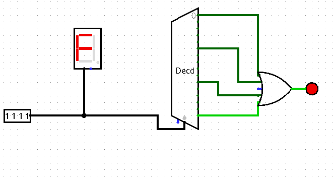

# Practica 1 4

## Circuitos combinacionales y secuenciales

### 1. Crea la tabla de verdad de un codificador de 8 entradas. Prueba con el simulador logisim que la tabla de verdad es correcta. ¿Qué significa que el codificador de logisim tiene prioridad?

|E0|E1|E2|E3|E4|E5|E6|E7|Resultado|
|--|--|--|--|--|--|--|--|---------|
|1|0|0|0|0|0|0|0|000|
|0|1|0|0|0|0|0|0|001|
|0|0|1|0|0|0|0|0|010|
|0|0|0|1|0|0|0|0|011|
|0|0|0|0|1|0|0|0|100|
|0|0|0|0|0|1|0|0|101|
|0|0|0|0|0|0|1|0|110|
|0|0|0|0|0|0|0|1|111|

Un codificador con prioridad significa que si hay varias entradas a la vez, mostrara la entrada de mayor valor.

### 2. ¿Qué salida presentará el siguiente multiplexor si A=0, B=1, C= 0, D=1, S0 = 1 y S1=1?. Justifica tu respuesta y compruebala con el simulador logisim.

El resultado sera el del D=1, porque las entradas de seleccion S0=1 y S1=1, que dan la posicion 3. Son cuatro entradas n-1, por lo tanto escoge la entrada de selccion da 3, que es la entrada 4.

### 3. Prueba en el simulador logisim un demultiplexor de 4 salidas. Crea la tabla de verdad con los resultados obtenidos.

|Entrada|Seleccion|Salida1|Salida2|Salida3|Salida4|
|-------|---------|-------|-------|-------|-------|
|0|00|0|0|0|0|
|0|01|0|0|0|0|
|0|10|0|0|0|0|
|0|11|0|0|0|0|
|1|00|1|0|0|0|
|1|01|0|1|0|0|
|1|10|0|0|1|0|
|1|11|0|0|0|1|

### 4. Completa el circuito siguiente para que con una entrada de 4 bits que muestra el dígito hexadecimal correspondiente, encienda un led cuando el dígito sea 0, 5, A o F.

### 5. Prueba con el logisim un “selector de bit” y explica cuál es su utilidad. ¿Es un circuito combinacional o secuencial?

Muestra el bit de entrada que el bit de seleccion indique. Es un circuito combinacional.

### 6. Diseña con puertas lógicas un sumador (HA) de 2 bits teniendo en cuenta la salida y el acarreo, no tengas en cuenta el acarreo de entrada. Compruébalo con el simulador.

### 7. Diseña con puertas lógicas un sumador (FA) de 2 bits teniendo en cuenta la salida y el acarreo tanto de entrada como de salida. Compruébalo con el simulador.

### 8. Crea un circuito restador de 8 bits en logisim, puedes utilizar todos los elementos disponibles en el simulador menos el restador.

### 9. Crea la tabla de verdad de un biestable J-K teniendo en cuenta los posibles estados anteriores. Comprueba tus resultados con el simulador logisim.

### 10. Busca en alguna tienda de electrónica un circuito integrado con biestables tipo D. Indica que circuito es, pon una captura del encapsulado del circuito y el diagrama de conexiones de los pines.

### 11. Crea en el simulador un contador del 0 al 15 con biestables J-K comprobando que funciona bien, en la salida debe aparecer la cuenta del 0 al 15 en binario de forma automática y con un separador de bits mostrar también la cuenta en decimal.

!()[]