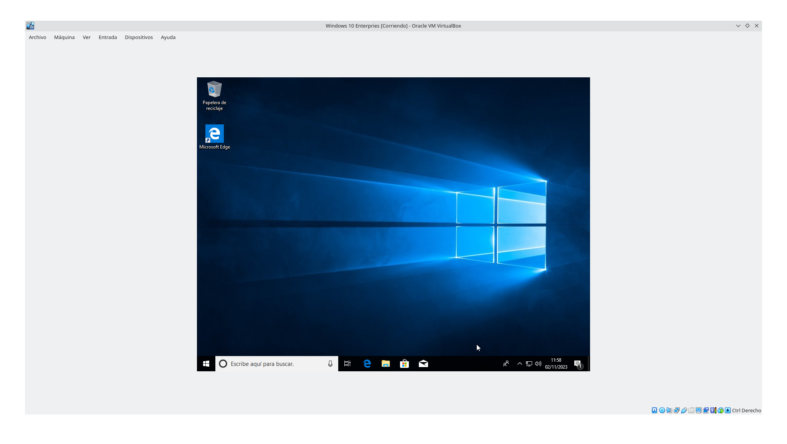
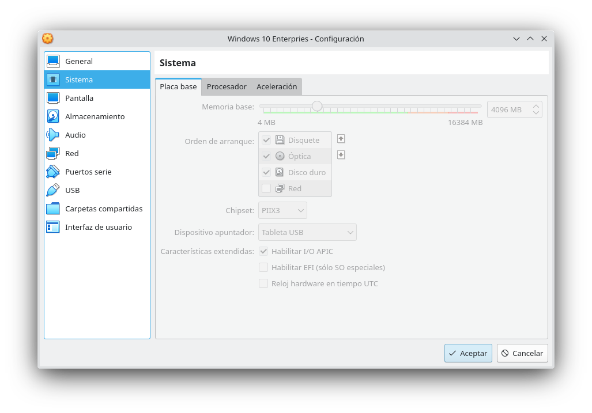
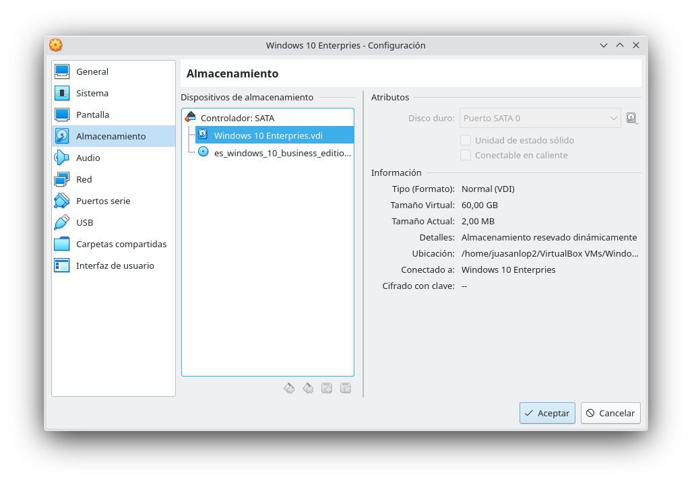
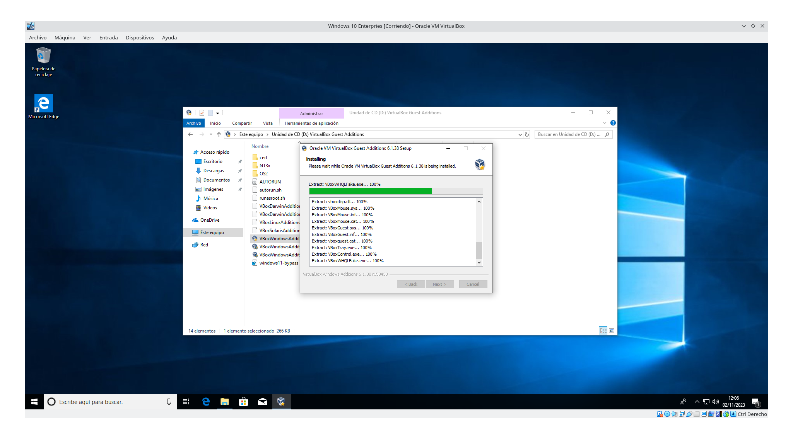

# Practica 1.6

## Sistemas Operativos y Virtualización

### 1. Instala Windows 10 Enterprise en una máquina virtual nueva con 4 GB de RAM, un disco duro de expansión dinámica de 60 GB, 2 procesadores y 128 MB de memoria de vídeo. Obtén una captura de pantalla del sistema virtualizado en ejecución tras finalizar la instalación.

### 2. Instala las “Guest Additions” en la máquina virtual, obtén una captura de pantalla del proceso de instalación. Reinicia el equipo tras la instalación. ¿Para qué sirven las “Guest Additions”?

* Adjusta la pantalla virtualizada con la pantalla host.
* Permite carpetas compartidas entre el sistema virtualizado con el host.
* Mejora la sincronizacion entre el host y el sistema virtualizado.

### 3. Prueba todos los modos de visualización del menú “Ver” de VirtualBox indicando para que sirve cada uno de ellos y su combinación de teclas de acceso rápido asociadas.

* Pantalla completa, como el propio nombre indica cambia el formato de la pantalla virtualizada de ventana a completa, la combinacion para entrar en pantalla completa es ctrl derecho + F.
* Modo fluido, es un modo intermedio entre ventana y pantalla completa, hace que el sistema virtualizado quede en pantalla completa pero dejando la barra de tareas del anfitrion visible para actuar rapidamente. Para entrar en ese modo es el Ctrl derecho + L.
* Modo escalado, convierte la pantalla en una ventana completa, quitando los menus de configuracion y ayuda de Virtual Box, puedes entrar con la combinacion Ctrl derecho + C.

### 4. Instala Ubuntu 22.04 Desktop en una máquina virtual nueva con 4 GB de RAM,un disco duro de expansión dinámica de 50 GB, 2 procesadores y 64 MB dememoria de vídeo. Instala las “Guest Additions” y obtén una captura de pantalla del sistema virtualizado en ejecución tras finalizar la instalación.
