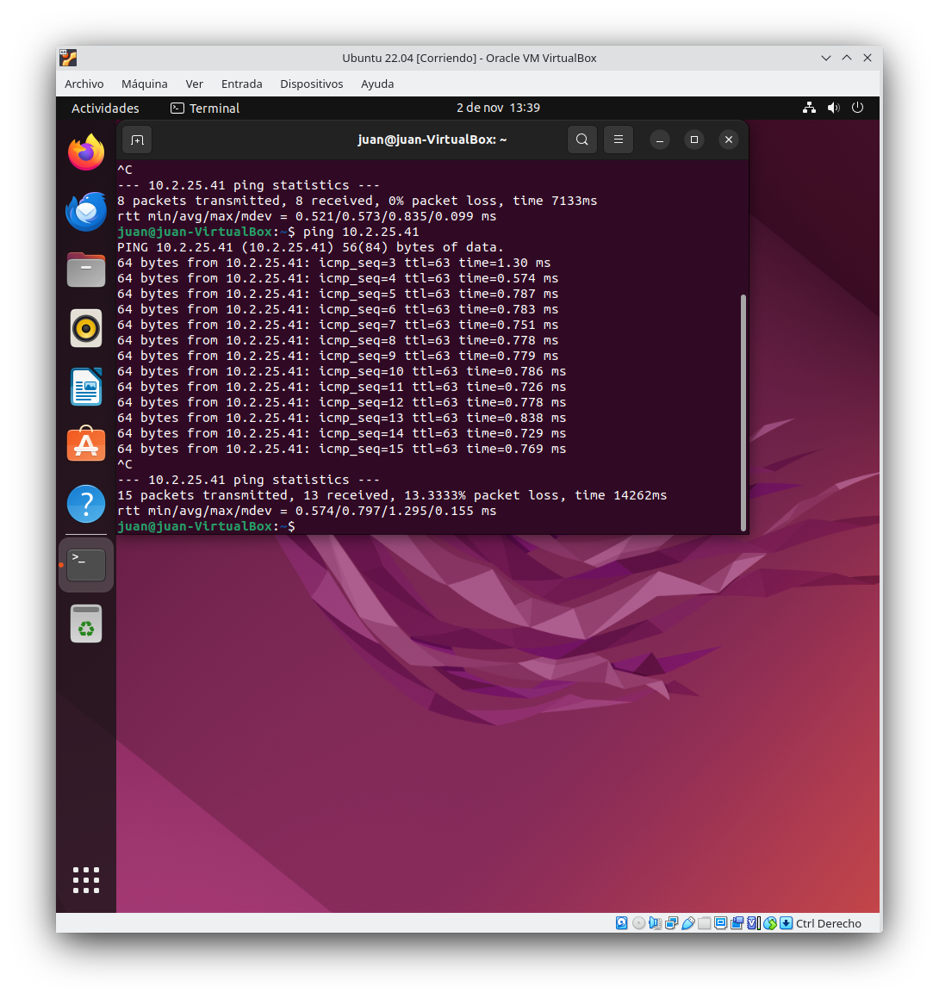

# Practica 1.6

## Sistemas Operativos y Virtualización

### 1. Instala Windows 10 Enterprise en una máquina virtual nueva con 4 GB de RAM, un disco duro de expansión dinámica de 60 GB, 2 procesadores y 128 MB de memoria de vídeo. Obtén una captura de pantalla del sistema virtualizado en ejecución tras finalizar la instalación.

### 2. Instala las “Guest Additions” en la máquina virtual, obtén una captura de pantalla del proceso de instalación. Reinicia el equipo tras la instalación. ¿Para qué sirven las “Guest Additions”?

* Adjusta la pantalla virtualizada con la pantalla host.
* Permite carpetas compartidas entre el sistema virtualizado con el host.
* Mejora la sincronizacion entre el host y el sistema virtualizado.

### 3. Prueba todos los modos de visualización del menú “Ver” de VirtualBox indicando para que sirve cada uno de ellos y su combinación de teclas de acceso rápido asociadas.

* Pantalla completa, como el propio nombre indica cambia el formato de la pantalla virtualizada de ventana a completa, la combinacion para entrar en pantalla completa es ctrl derecho + F.
* Modo fluido, es un modo intermedio entre ventana y pantalla completa, hace que el sistema virtualizado quede en pantalla completa pero dejando la barra de tareas del anfitrion visible para actuar rapidamente. Para entrar en ese modo es el Ctrl derecho + L.
* Modo escalado, convierte la pantalla en una ventana completa, quitando los menus de configuracion y ayuda de Virtual Box, puedes entrar con la combinacion Ctrl derecho + C.

### 4. Instala Ubuntu 22.04 Desktop en una máquina virtual nueva con 4 GB de RAM,un disco duro de expansión dinámica de 50 GB, 2 procesadores y 64 MB dememoria de vídeo. Instala las “Guest Additions” y obtén una captura de pantalla del sistema virtualizado en ejecución tras finalizar la instalación.

### 5. En la máquina virtual de Ubuntu configura la red como adaptador puente y realiza un ping desde la máquina real a la máquina virtual. Cambia la configuración del adaptador de red a NAT y vuelve a realizar las mismas pruebas. Obtén las capturas de pantalla con los resultados. ¿Qué diferencia hay entre usar un adaptador puente o NAT?

La diferencia entre el adaptador puente y el nat, el nat es mas lento y provoca perdidas, mientras que el puente no tiene estos problemas. A cambio la NAT es mas segura.

### 6. Crea un directorio en la máquina real llamado “CompartidaVM”. En cada máquina virtual crea una carpeta compartida llamada también “CompartidaVM” desde “Dispositivos → Preferencias de carpetas compartidas” con las opciones de “Automontar” y “Hacer permanente”. Haz una captura de pantalla donde se muestre el directorio “CompartidaVM” abierto en el sistema anfitrión y la misma carpeta abierta en el sistema huésped. Para que se realice automáticamente el montaje en la máquina virtual de Ubuntu es necesario que tu usuario de la máquina virtual pertenezca al grupo “vboxsf” *(sudo adduser tu_usuario vboxsf)*

### 7. Realiza una instantánea de la máquina virtual Windows. Realiza cualquier cambio en el sistema operativo y retrocede a la instantánea creada. Comprueba que los cambios realizados ya no existen.

### 8. Obtén una captura de pantalla de “Archivo → Administrador de medios virtuales” de VirtualBox. ¿Dónde se almacenan realmente las máquina virtuales? ¿Por qué el tamaño actual de los discos es diferente al tamaño establecido en la instalación?

Los discos duros .vdi estan guardados en subcarpetas de sus respectivos sistemas operativos a los que esten asignados en la carptea de Virtual Box.

Son diferentes porque los .vdi creados son discos duros dinamicos, lo que significa que su tamaño actual ira variando hasta el limite establecido por el usuario al crearlo.

### 9. Realiza una exportación en formato “ova” de la máquina virtual de Ubuntu. Elimina la máquina virtual de virtualbox y realiza la importación de la máquina exportada. Comprueba que la máquina nueva arranca.

### 10. Elimina las instantáneas de la máquina virtual Windows y el fichero “ova” de la máquina virtual Ubuntu.

