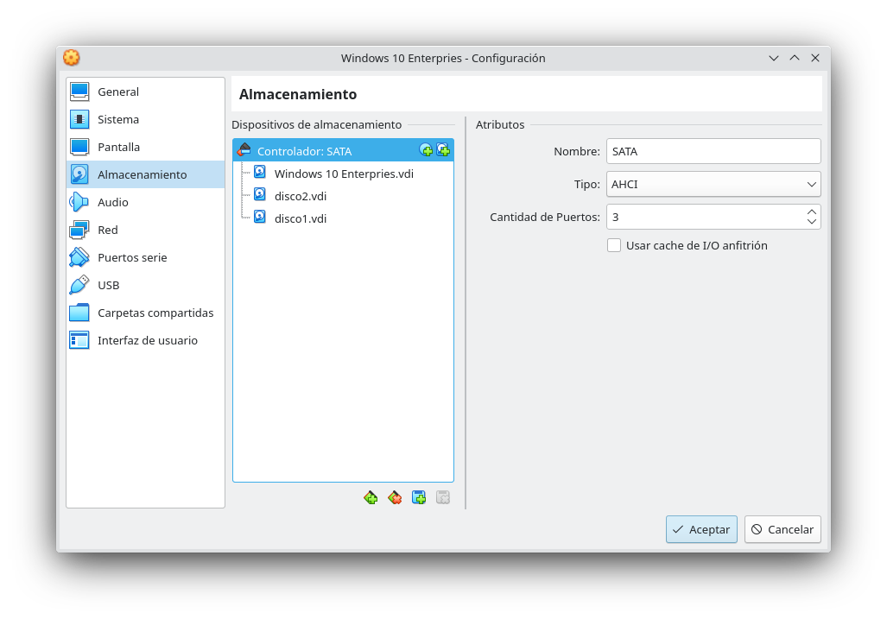
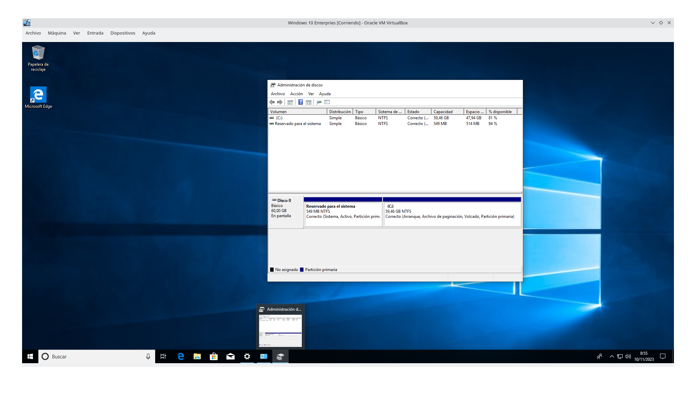
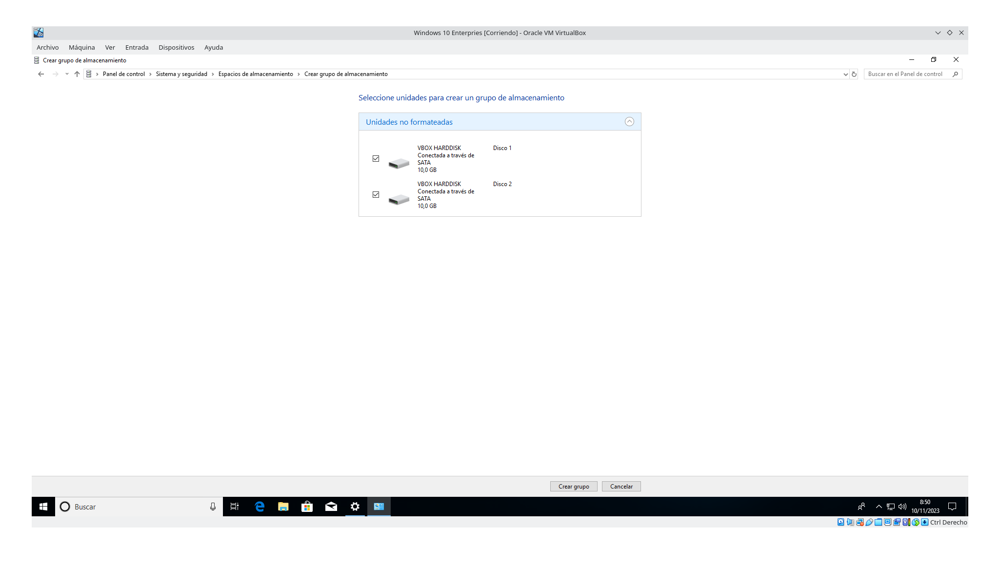
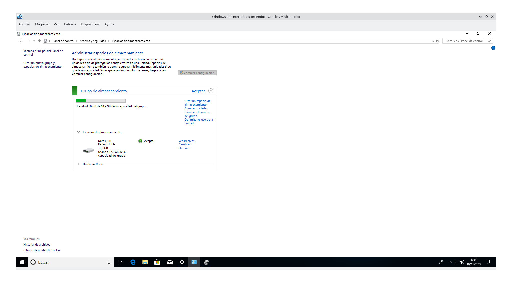
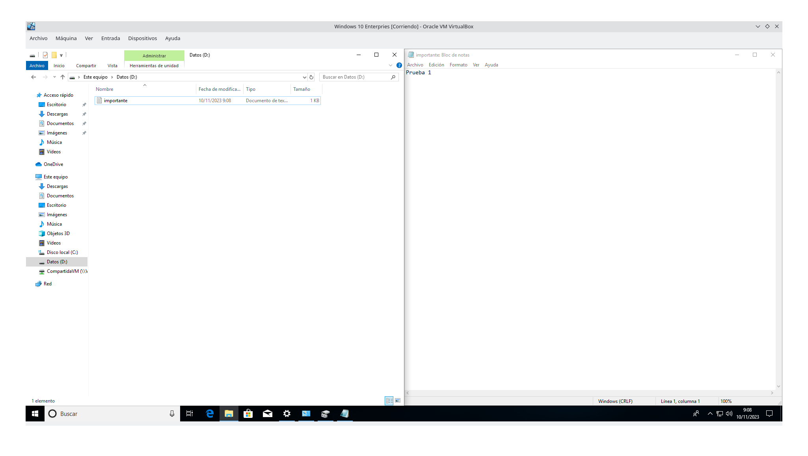
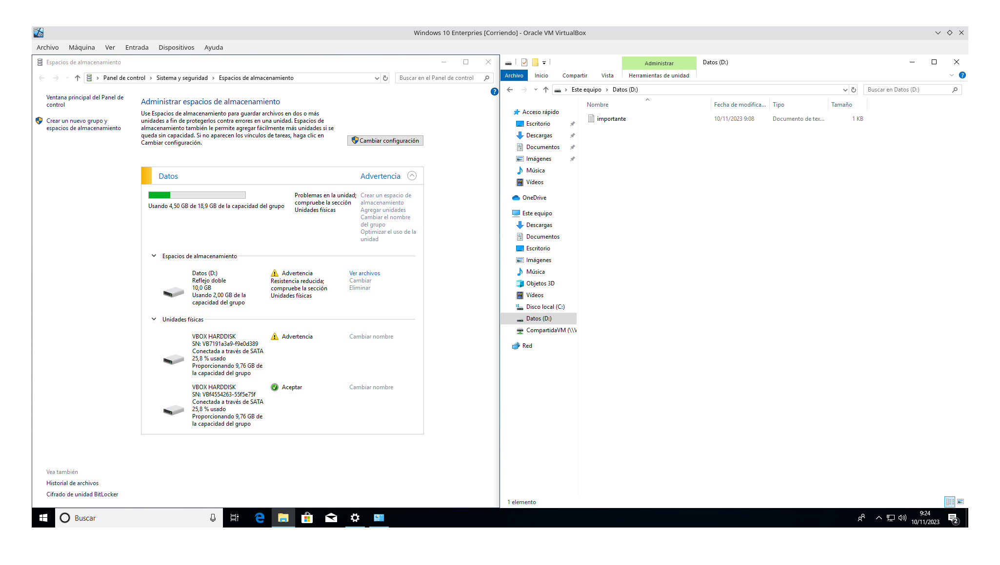
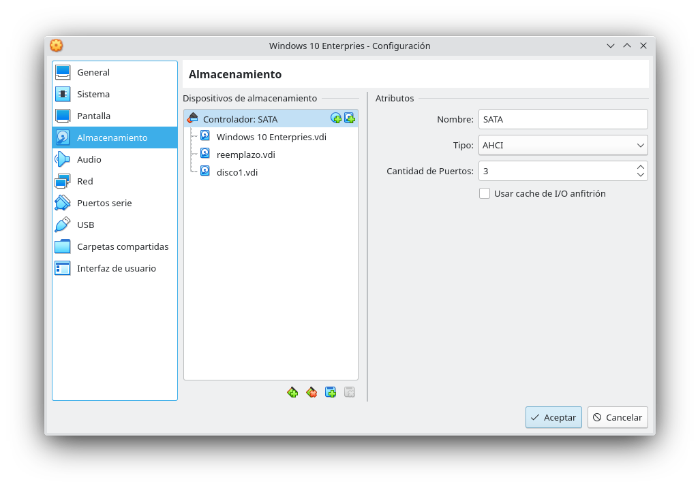
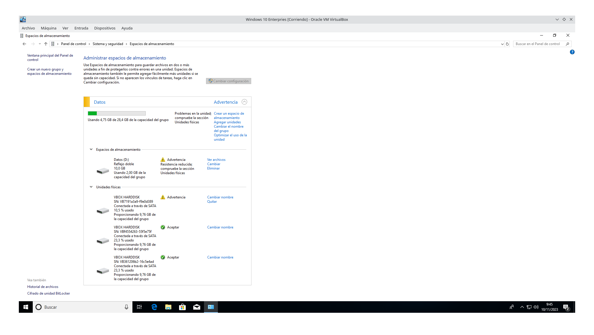
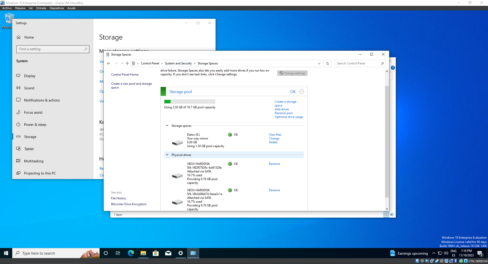
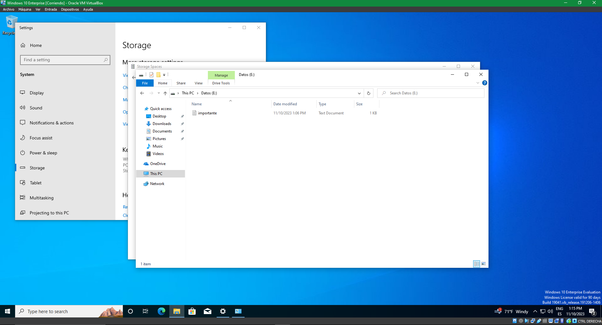

# Practica 1.8

## Seguridad Informática y Normativa Legal

### 1. Busca en alguna tienda de informática un SAI o UPS para un servidor, indicando precio y las características que consideres de interés.

### 2. En cuanto a los discos duros redundantes, completa la siguiente tabla resumen:

|                    | Nº de discos minimos |                                        Tolerancia a fallos                                        |                            Capacidad final con discos minimos                            |
| :----------------- | :-------------------: | :------------------------------------------------------------------------------------------------: | :---------------------------------------------------------------------------------------: |
| **Raid 0**   |    2 discos duros.    |                                       0 tolerancia a fallos.                                       |         La capacidad maxima sera el del tamaño del disco duro con menor espacio.         |
| **Raid 1**   |       2 discos.       |                 Buena tolerancia a fallos, si un disco falla pasara al siguiente.                 |                   Utilizara el maximo de uno de los discos conectados.                   |
| **Raid 0+1** |    4 discos duros.    | Buena tolerancia a fallos, si un disco falla, los datos del estaran guardados en un RAID 0 espejo. |         La capacidad maxima sera el del tamaño del disco duro con menor espacio.         |
| **Raid 5**   |    3 discos duros.    |                      Solamente se tolerará el fallo en una unidad a la vez.                      | El espacio disponible en el RAID 5 será de n-1, siendo n el número de discos del raid . |
| **Raid 6**   |    4 discos duros.    |            El sistema será tolerante al fallo de hasta dos unidades de almacenamiento.            | El espacio disponible en el RAID 6 será de n-2, siendo n el número de discos del raid . |

### 3. En la máquina virtual de Windows 10 vamos a crear un RAID 1 por software.

#### a) Con la máquina virtual apagada instalamos 2 discos duros nuevos, en “Configuración → Almacenamiento” añade dos discos de expansión dinámica de 10 GB cada uno, llamados “disco1” y “disco2” al controlador SATA.

#### b) Inicia el sistema y comprueba los discos en “Administración de discos”.

#### c) Accede a “Configuración → Sistema → Almacenamiento → Administrar espacios de almacenamiento” y crea un nuevo grupo de almacenamiento con los 2 discos nuevos llamado “DATOS” configurados en RAID 1.

#### d) Guarda en el nuevo volumen “DATOS” un fichero llamado “importante.txt” con el contenido que quieras.

#### e) ¿Físicamente en qué disco duro se está guardando el fichero “importante.txt?

Se esta guardando en ambos.

### 4. Vamos a suponer que un disco del RAID ha fallado y que lo tenemos que sustituir por otro. Con la máquina virtual apagada desconecta el disco “disco2” e inicia el sistema.

#### a) Comprueba que el fichero “importante.txt” sigue estando accesible.

#### b) Revisa el administrador de espacios de almacenamiento. ¿Qué significa la advertencia que tenemos?

La advertencia dice que la resistencia del grupo ha sido reducida, que compruebe las unidades fisicas para saber porque.

#### c) Para la máquina virtual y añade otro disco llamado “reemplazo”.

#### d) Inicia la máquina y agrega el nuevo disco al RAID para volver a tener tolerancia a fallos.

#### e) Quita del RAID el disco que ha fallado.

#### f) Comprueba que ahora el grupo de almacenamiento es correcto y que seguimos teniendo acceso al fichero “importante.txt”.

#### g) ¿Qué ventaja e inconveniente tiene tener 2 discos configurados en RAID1?

La ventaja es que mantiene los datos incluso si uno de ellos falla, y la desventaja, gastas 2 discos duros pero solo utilizas la memoria de uno.

